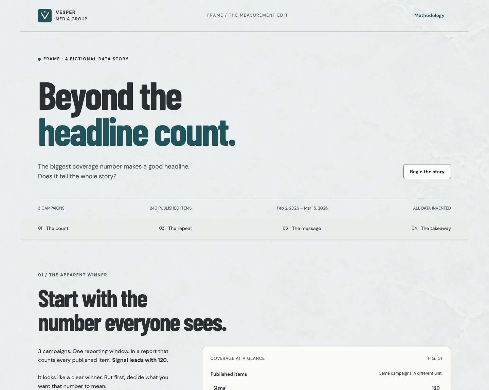

# Frame

An interactive editorial data story for communications leaders comparing campaign performance. This P302 portfolio case study is built for the **entirely fictional Vesper Media Group**. All campaigns, outlets, articles, excerpts and annotations are invented. The story moves from an apparent volume winner to distinct stories and message inclusion in campaign-specific priority outlets.

Built independently with **Vue 3, TypeScript, Vite and D3 scales with Vue-rendered SVG**. No database, AI service, notifications, shared backend state, or analytics feed. Fonts and data are served locally with the app. All four chapters work without animation; JavaScript is required to render the Vue application.



Screenshot of the Vesper UI 3.0 local production build at 1440px.

- Repository: [frame](https://github.com/andy-fitts-slalom/frame) (public)
- Production URL: [Open Frame](https://beyond-the-headline-count.vercel.app) — opened and browser-verified on September 30, 2026.
- Vercel project: `andy-protogen/frame`; connected GitHub repository, verified production branch `main`.

## Run and verify

Use Node.js 22.12 or newer and npm. Run these commands from this project directory:

```sh
npm ci
npm run dev
```

In a separate terminal, run checks or serve a production build:

```sh
npm test
npm run build
npm run preview -- --host 127.0.0.1 --port 4387 --strictPort
npm run test:e2e
```

Open the development URL printed by Vite. No API keys or environment variables are needed. Build before running preview or browser tests. Browser tests reserve port 4387; stop a manual preview on that port before testing to avoid testing an older build.

The browser suite uses installed Google Chrome by default. In CI or with Playwright-managed Chromium:

```sh
npx playwright install chromium
PLAYWRIGHT_CHANNEL=chromium npm run test:e2e
```

Run the same suite against production:

```sh
PLAYWRIGHT_BASE_URL=https://beyond-the-headline-count.vercel.app npm run test:e2e
```

Tests cover deterministic data, links/originals, deduplication, rates and denominator invariance, rankings, null versus zero, article evidence, resets, empty search, download success/failure, keyboard focus, reduced motion, direct chapter loads/refresh, responsive layouts and automated accessibility. See [verification](docs/VERIFICATION.md) for observed results and limitations.

## Explore the story

1. Read the opening comparison: Signal leads on published article volume.
2. Toggle published items to distinct stories to see how syndicated copies affect that comparison.
3. Compare priority-outlet message inclusion, with its numerator and denominator shown for each campaign.
4. Highlight a campaign, inspect supporting articles, and open the methods to understand the labels.
5. Read the takeaway and download the complete fictional dataset. Reset clears the interactive selection.

Selections and evidence searches are in memory and reset on reload; no account or browser storage is needed. Chapter anchors support direct links such as `/#message`.

## Dataset and measures

`npm run generate:data` deterministically regenerates `src/data/dataset.json`; no random seed or external source is required. The six-week window is February 2–March 15, 2026. There are 240 article records across three campaigns. [Data dictionary and generation assumptions](docs/DATA.md) explain the deliberately constructed distributions and prepared editorial annotations.

- **Published coverage:** count of article records, including syndicated copies.
- **Distinct stories:** unique `storyGroupId` values. Every group identifies one original article and belongs to one campaign.
- **Priority placements:** articles in outlets specifically prioritized by their campaign.
- **Priority message inclusion:** eligible articles with `messageIncluded=true` divided by all priority-placement articles. Both numerator and denominator are shown. Zero priority placements produce `null` / “Unavailable,” never 0%.

All charts and numerical narrative claims derive from the local records through `src/data/metrics.ts`. The volume toggle changes only the second volume chart. Campaign selection highlights comparisons without filtering populations. Evidence search affects only the supporting article list, which previews up to six matches; the complete dataset is downloadable. The unavailable-data demonstration is separate from the campaign records.

## Interpretation limits

Syndication can extend distribution; it is not inherently bad. Article counts are not unique audience reach. Message inclusion is not proof of reader understanding, behavior change or revenue impact. Labels are prepared fictional editorial annotations, not runtime AI judgments. The constructed data illustrates a scenario, not generalizable research or a causal result.

## Project structure

- `src/App.vue`: editorial narrative, controls, evidence and methods
- `src/components/VolumeChart.vue`: shared D3 scale / SVG comparison
- `src/data/`: complete typed JSON source and shared metrics
- `scripts/generate-data.mjs`: deterministic authoring assumptions
- `tests/`: unit and browser acceptance checks
- `docs/`: decisions, data dictionary, verification and durable continuation notes
- `public/licenses/`: full font license notices shipped with the site

See [BRIEF.md](BRIEF.md) for the acceptance contract and [AGENTS.md](AGENTS.md) before continuing work. Original prototype code is MIT licensed. Dependencies retain their own licenses; see [third-party notices](docs/THIRD_PARTY_NOTICES.md).

## Deployment

Vercel settings are in `vercel.json`: Vite, `npm ci`, `npm run build`, output `dist`. Use the dedicated project only. Production is built from `main`; chapter URLs use document anchors such as `/#message`, so direct loads and refreshes need no client-side route rewrite. Unknown paths should remain 404s.

To deploy manually with authorized account access:

```sh
npx vercel link --project frame --scope andy-protogen
npx vercel --prod --scope andy-protogen
```

Never commit `.vercel`, `.env*`, credentials or build output. Open and test the production URL after changes before calling the deployment verified.

## Shared design system

`@vesper/ui` 3.0.0 is installed from `vendor/vesper-ui-3.0.0.tgz`; keep the tarball and lockfile together. `npm ci` works without the sibling design-system source. Theme is paper, mode is editorial; package fonts/styles precede the app composition stylesheet. `src/presentation/campaignStyle.ts` maps campaign IDs to the shared chart palette, without changing domain metrics.

The product is Frame; its existing production URL retains the earlier project name. Historical migration records and screenshots describe previous releases. Current presentation uses Vesper UI only. Contributor publication constraints and the historical branch deployment guard are documented in [AGENTS.md](AGENTS.md).

The September 30, 2026 release evidence records 7 unit tests, 20 local and 20 production browser tests, production build and GitHub CI passing. See [verification](docs/VERIFICATION.md) for the recorded revision, scope and limitations; these are dated results, not a continuous availability guarantee.

The immutable dataset retains its original metadata title, “Beyond the Headline Count.” The campaign ID `frame` is data, independent of the product name. Downloads are named `frame-fictional-dataset.json` and contain the complete unchanged dataset.
